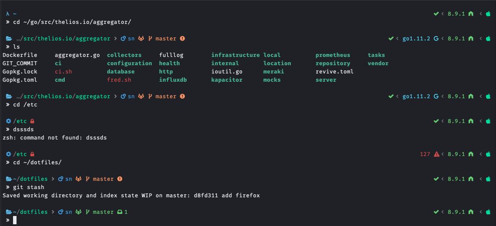

# Dotfiles
Source and installation scripts to setup following theme for your development environment.

# Installation

## OSX

### Required
Following packages will be installed
- [Antigen](https://github.com/zsh-users/antigen)
- [exa](https://the.exa.website/)

### Optional
- [tmux](https://github.com/tmux/tmux)

#### Initial setup
In the root of this repository:
```bash
sh .install/install_osx.zsh
```
#### Fonts
Script only download the font, now it's time to setup it in your desired terminal environment.

You can follow many popular environment setup guides [here](https://github.com/tonsky/FiraCode/wiki).

*Note: For vsCode, the font name is `FiraCode Nerd Font`*

*Note2: for vsCode terminal, you need to add `    "terminal.integrated.fontFamily": "FiraCode Nerd Font"` to options.*

#### CDPATH

in `.zshrc` file, you can modify the `cdpath` property to allow you to more easily access your projects and desired directories.

# Credit
Original theme and scripts made by [Scott Nesham](https://github.com/sevenfoxes)